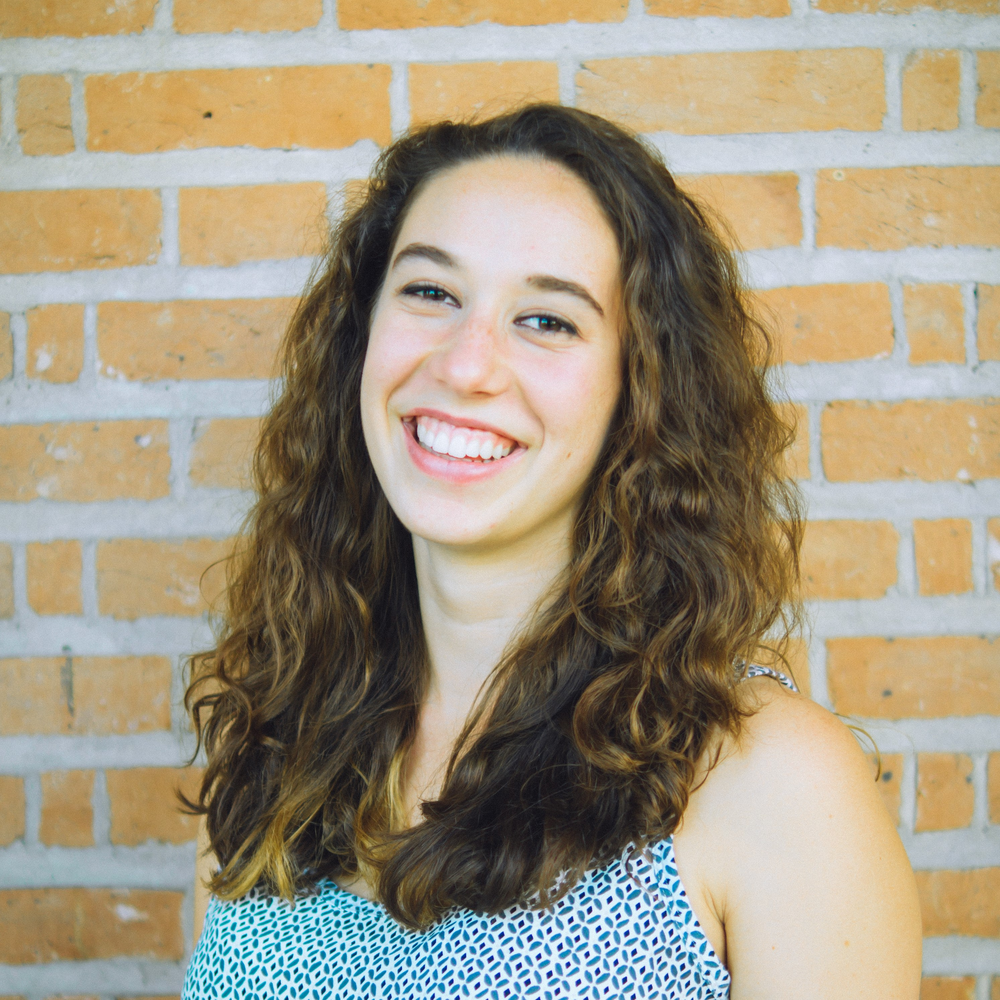

 My name is Claudia Kann and I am a first year PhD student in the Social Sciences at Caltech. Working with Michael Alvarez and Jonathan Katz I am focusing on the structural explanations for misrepresentation in the political system at the local and federal level. I am also interested in election administration. I received my B.S. in Mechanical Engineering from Rice University in 2017 and originally came to Caltech to pursue a PhD working with Robotics. After recieving  my M.S. in Mechanical Engineering from Caltech in 2019 I realized that I did not want to continue down that path. In the Winter of 2020 I began my move to the Social Science department which I officially joined in the Fall of 2020.  
 

