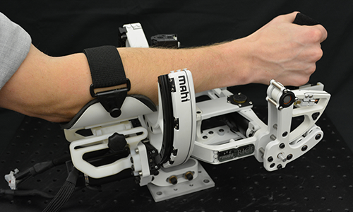

# Current  
--------------------------------------
### **Election Administration**  

This is what I'm doing for Election Administration

### **Board of Supervisors**  

This is what I'm doing for BoS

### **Covid Protest Tracking**  

### **Hidden Donors**  

# Past  
--------------------------------------
## **Mechanical Engineering**  
### **Amber Lab**, Caltech (2017-2020)  
 {:align = center width="1000"}
#### Publications   
 - Reher, Jenna, **Claudia Kann** , and Aaron D. Ames. \"An
    Inverse Dynamics Approach to Control Lyapunov Functions.\" arXiv
    preprint arXiv:1910.10824 (2019) ([pdf](https://arxiv.org/pdf/1910.10824.pdf))

- Tucker, Maegan, Ellen Novoseller, **Claudia Kann**, Yanan
    Sui, Yisong Yue, Joel Burdick, and Aaron D. Ames. \"Preference-Based
    Learning for Exoskeleton Gait Optimization.\" arXiv preprint
    arXiv:1909.12316 (2019) ([pdf](https://arxiv.org/pdf/1909.12316.pdf))
    
### **MAHI Lab**, Rice University (2015-2017)  
{:align = center width="1000"}

#### Publications
- C.G. Rose, E. Pezent, **C.K.Kann**, A.D. Deshpande, M.K.
    O'Malley., "Assessing Wrist Movement with Robotic Devices," in IEEE
    Transactions on Neural Systems & Rehabilitation Engineering (TNSRE),
    2017 ([pdf](https://ieeexplore.ieee.org/abstract/document/8404087))

- C. G. Rose, **C. K. Kann** , A. D. Deshpande, M. K.
    O'Malley., "Estimating Anatomical Wrist Joint Motion with a Robotic
    Exoskeleton," in IEEE Intl. Conf. on Rehab. Robotics (ICORR), 2017 ([pdf](https://ieeexplore.ieee.org/abstract/document/8009450))

