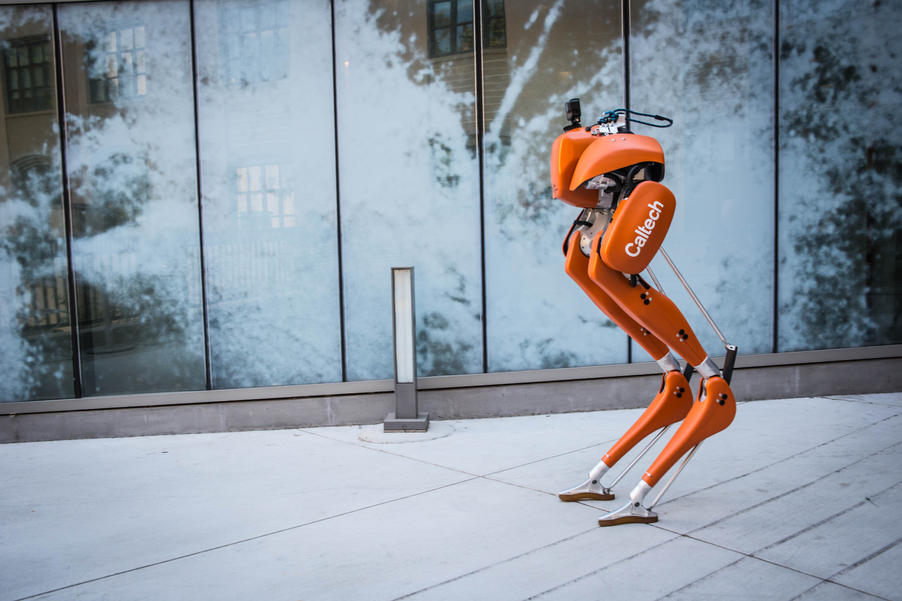

Feel free to explore some of my past and present research!  
# Current  
### **Election Administration**  
### **Board of Supervisors**  
### **Covid Protest Tracking**  
### **Hidden Donors**  

# Past  
## **Political Science**  
## **Mechanical Engineering**  
### **Amber Lab**, Caltech (2017-2020)  
{:align = left height="49%" width="49%"}
 -   [Reher, Jenna, **Claudia Kann** , and Aaron D. Ames. \"An
    Inverse Dynamics Approach to Control Lyapunov Functions.\" arXiv
    preprint arXiv:1910.10824 (2019).](https://arxiv.org/pdf/1910.10824.pdf)

-   [Tucker, Maegan, Ellen Novoseller, **Claudia Kann**, Yanan
    Sui, Yisong Yue, Joel Burdick, and Aaron D. Ames. \"Preference-Based
    Learning for Exoskeleton Gait Optimization.\" arXiv preprint
    arXiv:1909.12316 (2019).](https://arxiv.org/pdf/1909.12316.pdf)

### **Mechatronic and Haptic Interfaces Lab**, Rice University (2015-2017)  
{:align = left height="49%" width="49%"}
-   [C.G. Rose, E. Pezent, **C.K.Kann**, A.D. Deshpande, M.K.
    O'Malley., "Assessing Wrist Movement with Robotic Devices," in IEEE
    Transactions on Neural Systems & Rehabilitation Engineering (TNSRE),
    2017](https://ieeexplore.ieee.org/abstract/document/8404087)

-   [C. G. Rose, **C. K. Kann** , A. D. Deshpande, M. K.
    O'Malley., "Estimating Anatomical Wrist Joint Motion with a Robotic
    Exoskeleton," in IEEE Intl. Conf. on Rehab. Robotics (ICORR), 2017](https://ieeexplore.ieee.org/abstract/document/8009450)

